# 🏎️ AWS Three-Tier E-Commerce Web App — KL Performance

This project is a fully functional three-tier web application deployed on AWS — a car performance parts storefront called **KL Performance**. A customer browses products, clicks "Add to Cart," and the order is written to a database and triggers an email confirmation. It runs across a multi-AZ VPC behind a load balancer and CDN, fully deployed with Terraform and CI/CD pipelines.

This is the project I'm most proud of because it pulls together a bit of every project I've built before — the VPC networking and security design from my networking project, the SNS event notifications from my serverless project, and the CI/CD and custom domain work from my Cloud Resume Challenge — then goes beyond all of them by combining compute, a relational database, a load balancer, and a real application into one working system.

I also wanted to put a personal touch on this one. Cars are one of my biggest passions, so instead of a generic demo store I built KL Performance as a car parts storefront with real product categories like exhausts, coilovers, big brake kits, and ECU tunes. It made the project more fun to build and gave it some personality.

---

## 🏗️ Architecture Overview

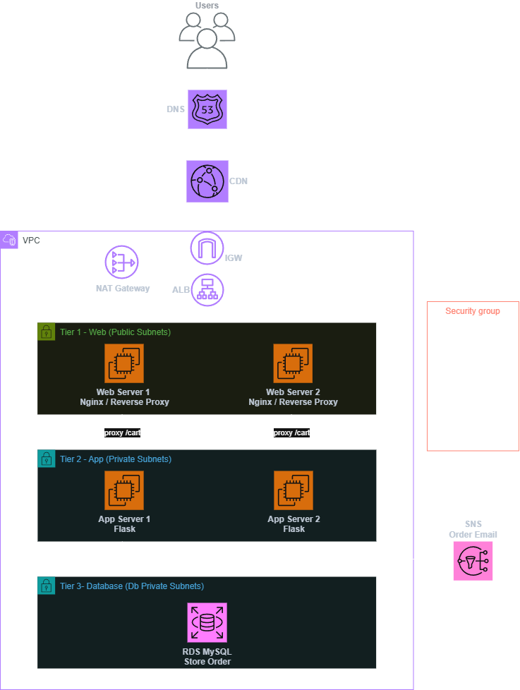

```

## 🛠️ AWS Services Used

| Service | Purpose |
|---|---|
| **VPC** | Isolated network with 6 subnets across 2 availability zones |
| **EC2** | 2 web servers (Nginx) and 2 app servers (Flask) across both AZs |
| **ALB** | Application Load Balancer distributing traffic across web servers |
| **RDS (MySQL)** | Relational database storing orders in private subnets |
| **CloudFront** | CDN serving the site over HTTPS with a custom domain |
| **Route 53** | DNS routing shop.kevinlutes.com to CloudFront |
| **ACM** | Wildcard TLS certificate for HTTPS |
| **SNS** | Email order confirmations to subscribers |
| **NAT Gateway** | Regional NAT allowing private instances outbound internet access |
| **EC2 Instance Connect Endpoint** | Secure access to private instances without a bastion |
| **IAM** | Least-privilege roles for app (SNS) and web (SSM) servers |
| **Terraform** | Full infrastructure as code using hashicorp/aws provider v6.24+ |
| **GitHub Actions** | CI/CD pipelines for infrastructure and website deployment |

---

## 📁 Project Structure

```
aws-three-tier-web-app/
├── infra/
│   ├── main.tf
│   ├── variables.tf
│   ├── outputs.tf
│   ├── backend.tf
│   ├── terraform.tfvars.example
│   └── userdata/
│       ├── web_server.sh
│       └── app_server.sh
├── website/
│   └── index.html
├── app/
│   └── app.py
├── .github/
│   └── workflows/
│       ├── terraform.yml
│       └── deploy-website.yml
├── screenshots/
├── .gitignore
└── README.md
```

---

## 🔑 Key Design Decisions

**Three-Tier Architecture**

The app is split into three layers, each with its own responsibility and security boundary. The web tier (Nginx) lives in public subnets and is the only layer reachable from the load balancer. The app tier (Flask) lives in private subnets and handles business logic. The data tier (RDS) lives in isolated database subnets and only accepts connections from the app tier. This separation means a compromise of the public-facing web layer doesn't give direct access to the database.

**Security Group Chaining**

Rather than opening ports to IP ranges, the security groups reference each other in a chain: the ALB accepts traffic from the internet, web servers accept traffic only from the ALB, app servers accept traffic only from web servers, and the database accepts traffic only from app servers. Each layer can only talk to the layer directly adjacent to it. This is the core of the three-tier security model.

**Multi-AZ for High Availability**

Web and app servers are deployed across two availability zones (us-west-1a and us-west-1c). If one AZ goes down, the load balancer routes traffic to the healthy instances in the other AZ. The architecture is designed for availability even though this is a demo project.

**EC2 Instance Connect Endpoint over Bastion Host**

For accessing private app servers I used an EC2 Instance Connect Endpoint rather than a traditional bastion host. It removes the need to manage and pay for a separate bastion instance and provides browser-based access without key pairs. In a production team environment SSM Session Manager would be preferred for its full audit logging and zero open ports.

**Nginx as a Reverse Proxy**

The browser can't talk directly to the app servers since they're in private subnets. Instead Nginx on the web servers reverse-proxies `/cart` requests to the Flask app servers internally. This keeps the proper three-tier flow — the browser only ever talks to the public web layer, which forwards requests internally.

**Remote State with S3 + DynamoDB**

Terraform state is stored remotely in S3 with DynamoDB state locking. This was a deliberate decision after an early issue where running deployments without remote state created duplicate resources. Remote state means every deployment knows exactly what already exists and prevents conflicts.

---

## 🌍 Infrastructure Overview

### VPC & Networking
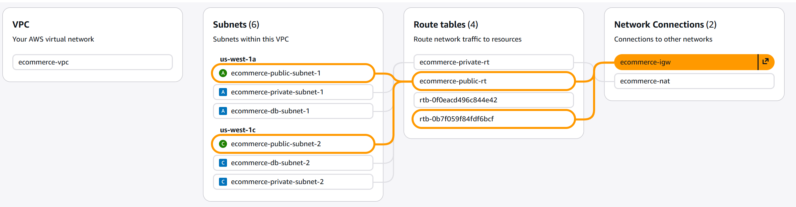
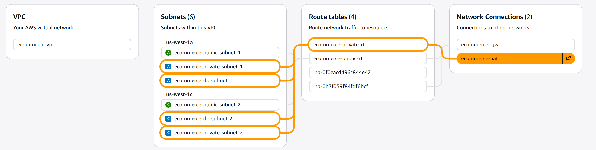
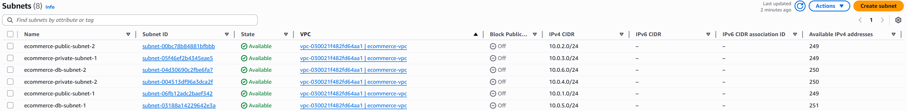
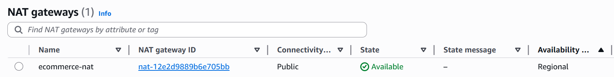
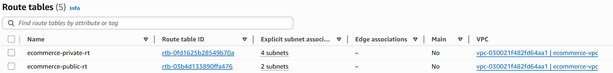

### Security Groups
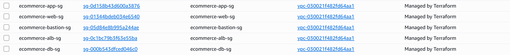

### EC2 Instances
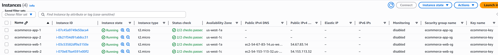

### Application Load Balancer
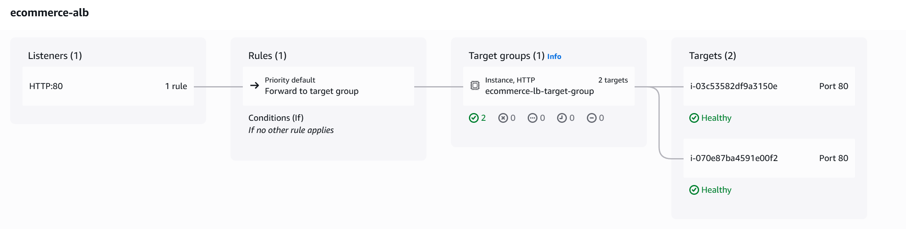

### EC2 Instance Connect Endpoint
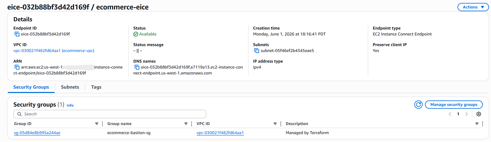

### RDS Database
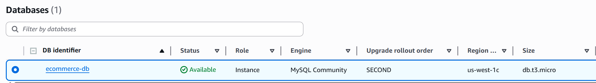

### CloudFront & Route 53
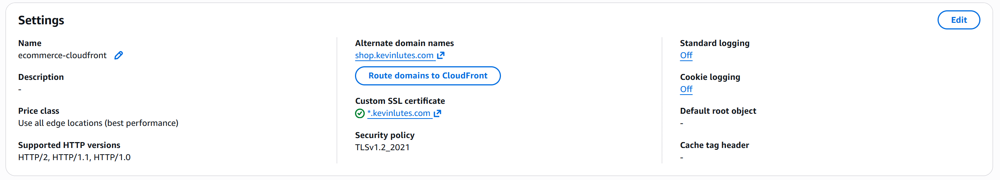


---

## ✅ Validation

### Live Storefront
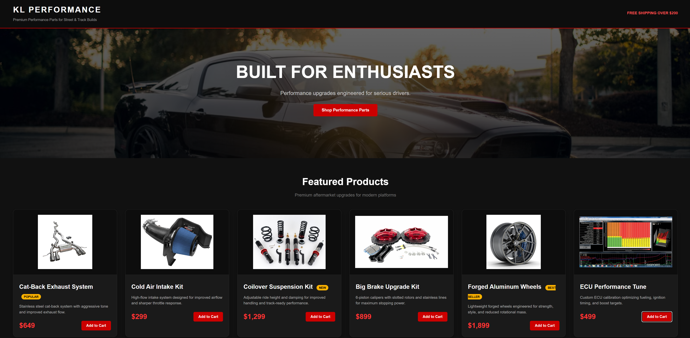

### Custom Domain with HTTPS
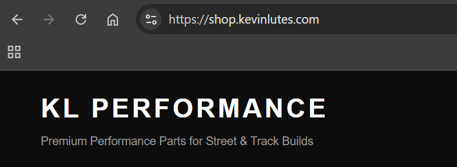

### Add to Cart — Order Confirmation
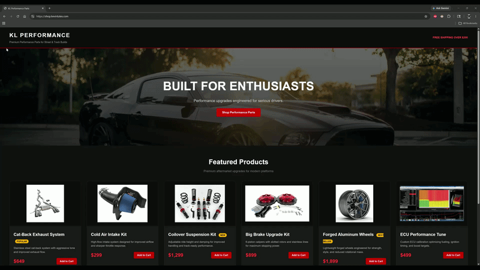

### SNS Email Notification
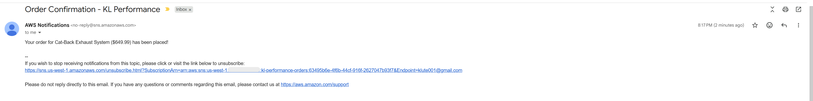

### Order Stored in RDS
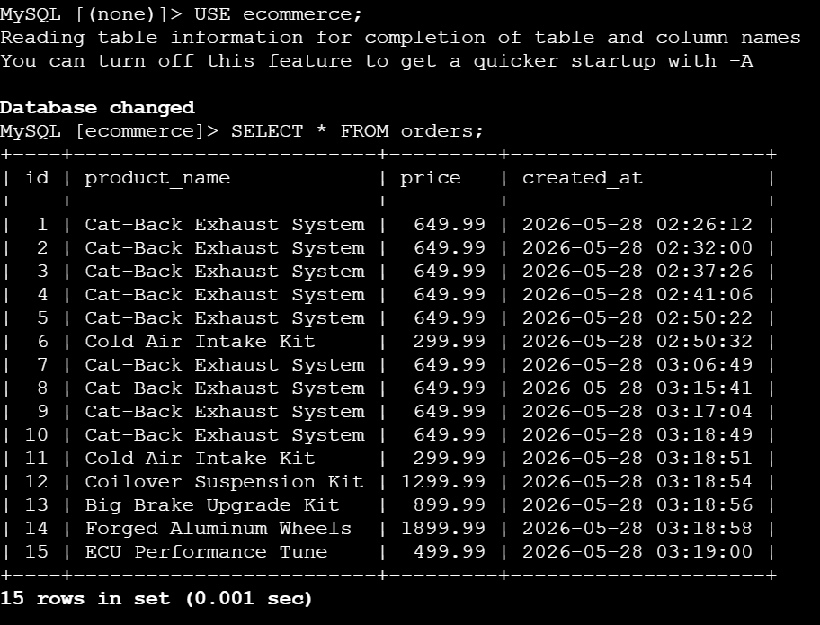

### Flask Service Running
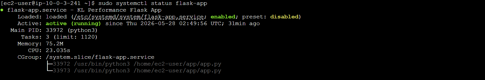

---

## ⚙️ CI/CD Pipelines

Two GitHub Actions workflows automate deployment:

**Terraform Pipeline (`terraform.yml`)** — On changes to `infra/`, runs format check, validate, plan, and apply. Uses OIDC to authenticate to AWS without storing access keys, and stores state remotely in S3 with DynamoDB locking.

**Website Pipeline (`deploy-website.yml`)** — On changes to `website/`, uses SSM to push the updated HTML to both web servers and restart Nginx. No SSH or manual steps required.

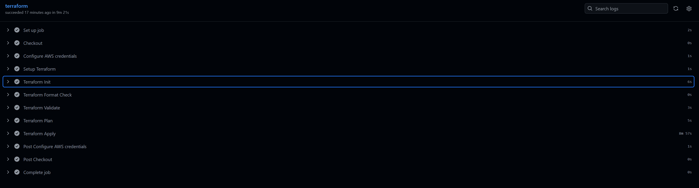
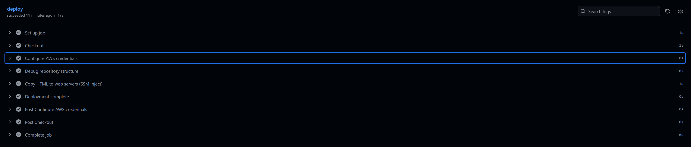

> **A note on CI/CD and my preferred workflow:** I built the full Terraform pipeline as a learning exercise — OIDC authentication, S3 remote state, and DynamoDB locking — to understand how automated infrastructure deployment works end to end. After working with it I settled on a hybrid approach: running Terraform locally for `plan` and `apply` while using GitHub for version control. Auto-applying on every push meant changes hit AWS before I had a chance to review the plan, which felt like too little control for a solo project. For the website deployment it's a different story — I fully prefer the CI/CD pipeline there. Pushing a change to `website/` and having it automatically deploy to both web servers via SSM is exactly the right use case for automation, with no risk of accidentally changing infrastructure.

---

## 📚 What I Learned

- How the three tiers of a web application map to AWS networking and security boundaries
- Writing an entire multi-tier infrastructure in Terraform from scratch — VPC, subnets, route tables, security groups, RDS, EC2, ALB, CloudFront, Route 53, IAM
- How security group chaining enforces the three-tier security model
- Why remote state with locking matters and how it prevents duplicate resource creation
- Setting up OIDC authentication so GitHub Actions can deploy to AWS without stored credentials
- Building a full CI/CD pipeline for Terraform — and learning through experience which workflow actually suits a solo project
- How a reverse proxy lets a public web tier forward requests to a private app tier

---

## 🤖 A Note on AI Assistance

The Flask backend, JavaScript cart logic, and GitHub Actions pipeline YAML were written with AI assistance. My focus for this project was the AWS architecture — the three-tier design, security group model, and Terraform implementation, which I wrote myself. I understand what the application code and pipeline stages do and how they fit the architecture, but writing them from scratch is something I'm actively working toward.

---

## 🧩 Challenges & Lessons Learned

**Regional NAT Gateway Requires an Attached Internet Gateway**

When creating the Regional NAT Gateway, the VPC wouldn't appear in the dropdown. The cause was that the Internet Gateway hadn't been attached to the VPC yet — Regional NAT Gateway requires it first. In Terraform this is handled with a `depends_on` to enforce ordering.

**Amazon Linux 2023 Uses `mariadb105` not `mysql`**

The user data script originally tried to install the `mysql` package which doesn't exist on Amazon Linux 2023. The correct package is `mariadb105`, which provides the MySQL-compatible client. This caused the initial database connection tests to fail until I tracked down the package name.

**Remote State Prevents Duplicate Resources**

Early on, running the CI/CD pipeline without remote state caused failed runs to create duplicate resources — at one point I had 8 EC2 instances and 3 VPCs from repeated partial deployments. Setting up S3 remote state with DynamoDB locking fixed this permanently, since every run now references the same state file.

**Flask Must Run as a systemd Service**

Running Flask manually meant it died when the session timed out. Creating a systemd service ensures Flask starts automatically on boot, restarts on failure, and survives session disconnects. The user data script now sets this up automatically with the environment variables injected by Terraform.

---

